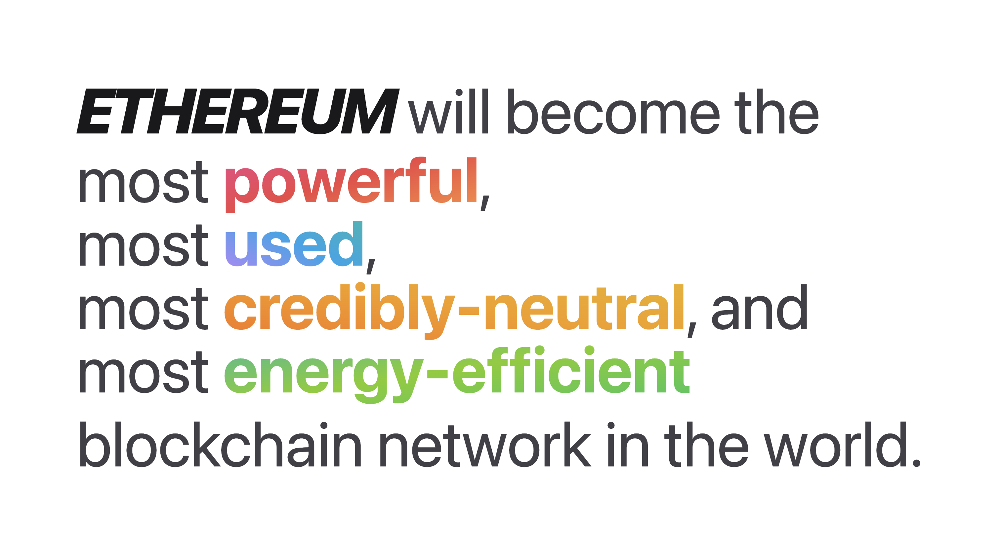

# An Educational Website about the Ethereum Portal Network

I was learning about the Ethereum Portal Network and noticed that the original website (ethportal.net)[https://ethportal.net] could use a facelift and I wanted to practice my frontend skills some more, so I recreated the website in Next.js with Tailwind CSS.

Hopefully this website might attract some keen eyes and ultimately get them interested in Ethereum Light Nodes and the Portal Network.

